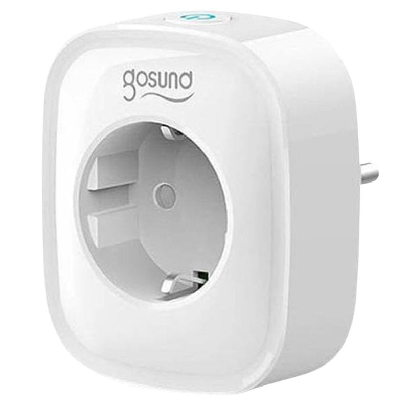

# Gosund SP1 3680 W 16 A WLAN
Gosund SP1 3680 W 16 A WLAN para integração no ESPHome
Esquema, PCB e código Yaml.

Substituição do microcontrolador Tuya CUCO Z0 R v1.2 por um ESP8285 M1 ou M2
Necessário soldar componentes SMD e a nova placa no PCB da Tomada

Gosund SP1 3680 W 16 A WLAN for integration into ESPHome
Schematic, PCB and Yaml code.

Replacing the Tuya CUCO Z0 R v1.2 microcontroller with an ESP8285 M1 or M2
Need to solder SMD components and the new board onto the socket PCB
